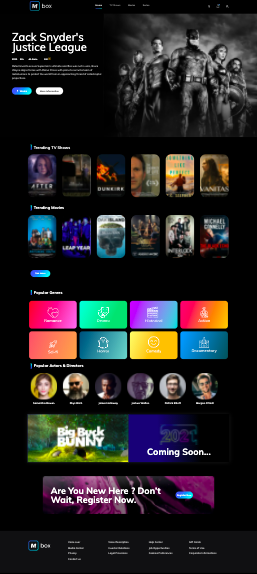
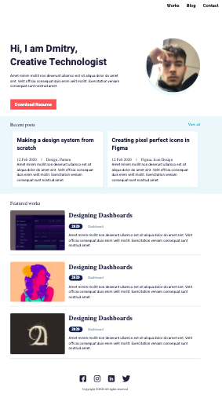
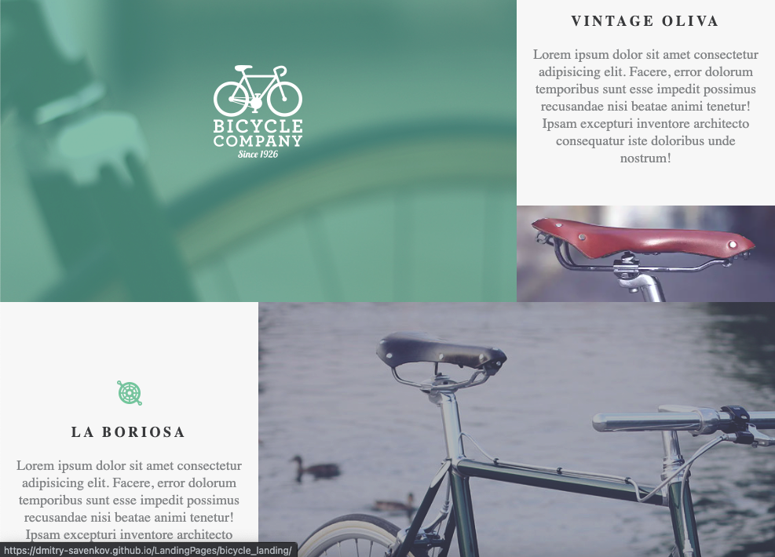

**My LandingPage where i am using BEM, HTML5, SCSS/SASS, JS and Gulp, all pages Responsive and Adaptive**. 

**to access the source code you need to go to the gh-pages branch**

* * *
​  

this page was made with *FlexBox*. Full adaptive for devices with different extensions.  
https://dmitry-savenkov.github.io/LandingPages/kino_go/
* * *
​  

https://dmitry-savenkov.github.io/LandingPages/cv_site/. 
Full adaptive for devices with different extensions.  
This page was made with *FlexBox*.  
* * *
​  

Full adaptive for devices with different extensions.  
This page was made with *FlexBox*.  
https://dmitry-savenkov.github.io/LandingPages/bicycle_landing/
